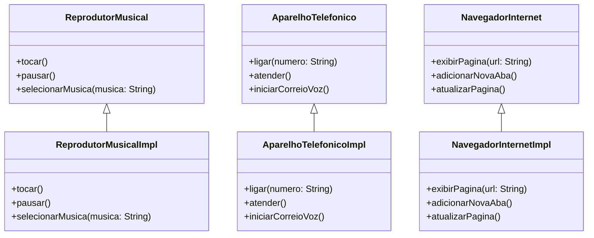

```mermaid
classDiagram
    class ReprodutorMusical {
        +tocar()
        +pausar()
        +selecionarMusica(musica: String)
    }

    class ReprodutorMusicalImpl {
        +tocar()
        +pausar()
        +selecionarMusica(musica: String)
    }

    class AparelhoTelefonico {
        +ligar(numero: String)
        +atender()
        +iniciarCorreioVoz()
    }

    class AparelhoTelefonicoImpl {
        +ligar(numero: String)
        +atender()
        +iniciarCorreioVoz()
    }

    class NavegadorInternet {
        +exibirPagina(url: String)
        +adicionarNovaAba()
        +atualizarPagina()
    }

    class NavegadorInternetImpl {
        +exibirPagina(url: String)
        +adicionarNovaAba()
        +atualizarPagina()
    }

    ReprodutorMusical <|-- ReprodutorMusicalImpl
    AparelhoTelefonico <|-- AparelhoTelefonicoImpl
    NavegadorInternet <|-- NavegadorInternetImpl

```
